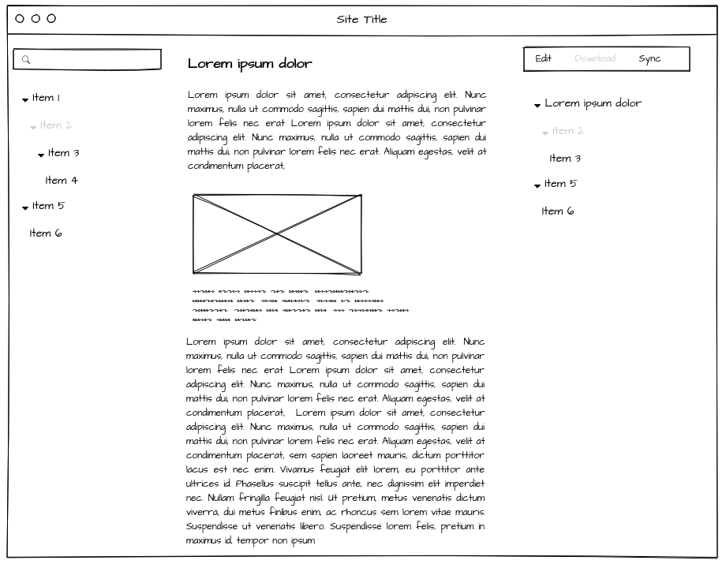

# DriveMyDoc-POC
This is a proof of concept made with Ruby on Rails. A more front-end project will follow soon.

---

## Why this project

Because as a dev and a Github user, I like using Markdown for many usage like documentation. Github Wikis are great but it's not everybody who I work with are comfortable with git, Github or event Markdown syntax. And Github Wikis cannot host any types of files.

So to have anyone in one place and make everybody happy, I started **DriveMyDoc**.


## Why Google Drive

- Anyone can use it and already used to it
- Document managing and editing through Google Drive
- Document organisation and hierarchy through Google Drive
- Access permission through Google Drive
- Can manage and edit many type of files


## Wanted feature

- List file from a given folder recursively has a table of content
- Render certain type of files
	- Markdown
	- Image
	- PDF
- Search for a file through Google Drive API
- Link to the file to
	- Edit
	- Download
	- Sync
- Table of content for the current file (only Markdown)
- Easy way to updload attachements into Google Drive and retrive direct link


## Preview interface



## Application information

- Rails 5.2.2
- Ruby 2.3.7
- Database SQLite

### Getting starting

```bash
bundle install
bundle exec rake db:migrate
rails server
```
### Docker

**Build**

```bash
$ docker build -t drivemydoc .
```

**Run**

```bash
docker run -p 3000:3000 -e "GOOGLE_CLIENT_ID=<<ID>>.apps.googleusercontent.com" -e "GOOGLE_CLIENT_SECRET=<<SECRET>>" -e "ROOT_FOLDER_ID=<<FOLFER_ID>>" drivemydoc
```
